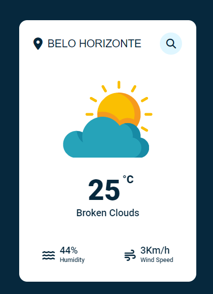

### Weather App
Project done in JavaScript with [Weather API](https://www.meteomatics.com/en/weather-api/?ppc_keyword=weather%20api&gclid=Cj0KCQjwwvilBhCFARIsADvYi7LdJTs1Iez8d8Ofk92wKx-Oz0G3YPyWGDX-mYPAd3fdOXmCEuJ-xlIaAvOCEALw_wcB)

## Warning
You need to get your own api key (in video we showed how!) and replace it in index.js file on line 9 :

```javascript
const APIKey = '${id}';
```

# Screenshot
Here we have project screenshot :


